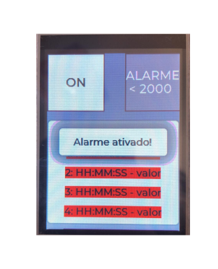
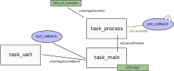
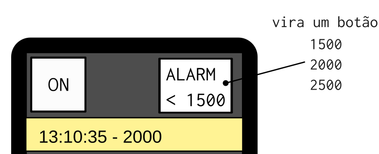

# 21a - emb - AV2

>  Faça o seu trabalho de maneira ética!

- **A cada 30 minutos você deverá fazer um commit no seu código!**
    - Códigos que não tiverem commit a cada 30min ou que mudarem drasticamente entre os commits serão descartados (conceito I) !!
    - Você deve inserir mensagens condizentes nos commits!
- Duração: 3h

Usem como base o código disponível neste repositório.

- ▶️ Conecte o potênciometro no pino PC31 do EXT-1

## Descrição

A ideia é que vocês desenvolvam um data logger, esse data logger será um equipamento que **a cada 4 segundos** coleta um novo valor analógico (potenciômetro) o atribui um TimeStamp (RTC) e o exibe no LCD em formato de lista.

- Video da entrega C: https://youtu.be/8d7n7OFVNqI

### Detalhes da interface

A interface a ser implementada (fornecida quase pronta) possui a interface e os elementos do LVGL listados na figura a seguir:


- ON: é um botão que liga/desliga a aquisição de dados;
    - tratado na função: `btn_on_handler`
- ALARM: é um botão que possibilita mudar o valor do alarme;
    - tratado na função: `btn_alarmValue_handler`
- Lista: É o local onde o valor analógico deve ser exibido.
    - A cada novo valor, a lista deve ser deslocada e o valor mais novo adicionado ao topo. 
    - Novo item a cada **4 segundos**
    - Formato: `HH:MM:SS - Valor`
    - Implementado com 5 labes no vetor:
    
    ```c
    #define LIST_LEN 5
    lv_obj_t * label_list[LIST_LEN];
    ```
    
Cada valor analógico exibido na lista deve ser associado a uma cor, como ilustrado no diagrama e seguindo a escala de cores a seguir:

{width=60}

### Alarme

Se todos os itens que estão sendo exibidos no LCD tiverem valor menor que `2000` o alarme deve ser ativado e a interface deve passar a exibir a mensagem a seguir:



O alarme é desativado **somente quando o botão da placa for pressionado** ou**comando de clear chegar via comunicação serial**, ele não deve desligar sozinho.

### Detalhes do firmware

O código deve ser desenvolvido com o freertos e possuir a estrutura a seguir:



onde:

- `task_process`: processa os dados e os envia para a `task_main` exibir
- `task_main`: responsável por exibir os dados e interagir com o usuário
- `task_uart`: responsável por tratar a comunicação e detectar quando o alarme foi desativado.
- `vTimerAfecCallback`: onde é feita a leitura do AFEC.
    - 👌 **Já foi dado pronto**
- `but_callback`: callback do potão da placa.

O código deve possuir os seguintes semáforos:

- `xSemaphoreOk`: indica que o botão do lvgl de On/Off foi apertado.
- `xSemaphoreAlarm`: indica que o alarme foi desativado (botão ou uart).

E as filas a seguir:

- `xQueueAdc`: Contém o valor lido convertido para digital (ADC).
    - 👌 **A leitura AFEC já está pronta, você só precisa ler a fila.**
- `xQueueDados`: ADC + timestamp (HH:MM:SS) na qual o dado foi coletado e enviado
    - struct com [dado, relógio]

### protocolo

O comando para desativar o alarme é descrito a seguir (cada símbolo do protocolo é um char de 8 bits):

``` 
   HEAD COMMAND1 COMMAND0 EOP
```

Onde:

- HEAD: 'P'
- COMMAND1: 'C'
- COMMAND0: 'A'
- EOP: 'X'

Um programa python (`protocolo.py`) onde vocês podem enviar o comando de Clear do alarme pela UART 
e testar o firmware.

### Dicas

Dicas gerais:

1. Antes de começar leia o código
1. Várias coisas já foram dadas prontas:
    - Tela do LVGL 
    - Leitura do AFEC (dados vão para a fila xQueueAdc)
    - RTC iniciado
    - Tasks criadas: main, process, uart, lcd
1. Faça o desenvolvimento por partes e testa de forma incremental.
1. Travou? Não funciona? **Debugou!** e ainda não funciona? Nome na fila!
1. Estruture os dados da `xqueue_dado` em um struct.
1. Para mudar a cor de fundo do label da lista use:
``` c
// i é o index da lista que quer alterar a cor.
lv_obj_set_style_local_bg_color(label_list[i], LV_OBJ_PART_MAIN, LV_STATE_DEFAULT, LV_COLOR_RED);
```
1. Para ativar o alarme basta chamar a função: `lv_create_alarm();`
    - **ATENÇÃO! Não chame o `lv_create_alarm()` mais de uma vez sem antes ter destruido ele**
1. Para destruir o alarme: `lv_obj_del(mbox_alarm);`
    - **ATENÇÃO! Não chame o `lv_obj_del(mbox_alarm)` sem antes ter criado o alarme**

## Rubricas

Vocês devem gravar um vídeo do firmware funcionando ao submeterem o código.

:triangular_flag_on_post: **Ao finalizar a entrega preencher o formulário (uma única vez!)**

https://docs.google.com/forms/d/e/1FAIpQLSdTsczFvHSfC040AoKjKUI0w3BMVYC38oVqaGtF4cUUIN2Mlg/viewform?usp=sf_link

### C

- [ ] **Segue a estrutura de firmware especificada (semáforos e filas)**
- [ ] Exibi a lista atualizada a cada 4 segundos
- [ ] Usa RTC para o timestamp
    - valor é enviado junto com o ADC na fila `xqueue_adc`
- [ ] Exibe o item na lista seguindo a escala de cores
    - time stamp + valor
- [ ] Botão de on/off da captura de dados
- [ ] Exibe tela de alarme se todos itens da lista ficarem a baixo de 2000
- [ ] Alarme é desativado somente por botão da placa ou pelo recebimento do pacote (quando nenhum valor da lista abaixo do valor do limite do alarme)

### extras (cada um é +0,5 conceito)

- (+0.5) Adicione novo um label para exibir o valor máximo dos dados que estão na tela (somente ADC).

- (+0.5) Cria função para:
    - inserir um novo valor e rotacionar a lista
    - verificar se ativa alarme
    - desenhar a lista

- (+0.5) Exibe um relógio na tela (atualiza a cada 1s)
    - **O RTC fornecido de exemplo não tem interrupção**

- (+0.5) `"Alarm \n <2000"` vira um botão que altera o nível do alarme. Cada vez que o botão for apertado o valor muda entre um disponível na lista: `[1500, 2000, 2500]`. Esse novo valor deve ser o `threshold` para o alarme e isso inclui as escalas de cor (qual item que fica vermelho).
    - O botão já foi implementado no LVGL.



- (+1.0) Possibilita mudar o valor do alarme via comunicação serial:
    - HEAD: 'S'
    - [C1 C0]: Definem o valor do threashold (em ASCII): [`00`: 1500, `01`: 2000, `10`:2500]
    - Exibir o valor novo no label do botão `btn_alarmValue`
